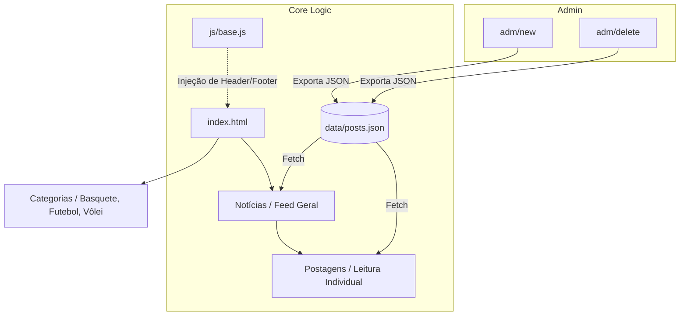

# Blog de Esportes

Um blog moderno e responsivo focado em notícias esportivas (Futebol, Basquete e Vôlei), desenvolvido com tecnologias web fundamentais. O projeto conta com um sistema de carregamento dinâmico de notícias e um painel administrativo simplificado.

---

## Funcionalidades

- **Navegação por Categorias:** Páginas dedicadas para Futebol, Basquete e Vôlei.
- **Feed de Notícias Dinâmico:** Carregamento automático de postagens via JSON.
- **Leitura de Posts:** Sistema de visualização de artigos individuais via parâmetros de URL.
- **Painel Administrativo:** Interface para criação e exclusão de postagens (gestão de dados local).
- **Design Responsivo:** Adaptado para diferentes tamanhos de tela.

## Tecnologias

- **Markup:** HTML5 Semântico
- **Estilos:** CSS3 (Flexbox & Grid)
- **Lógica:** JavaScript Vanilla (ES6+)
- **Dados:** JSON (Persistência local)
- **Hospedagem:** Vercel

## Arquitetura



## Estrutura do Projeto

```text
Blog-Esporte/
├── adm/             # Painel administrativo (CRUD manual)
├── assets/          # Recursos estáticos (imagens e ícones)
├── categorias/      # Páginas de modalidades específicas
├── css/             # Folhas de estilo modulares
├── data/            # Armazenamento de dados (JSON)
├── js/              # Lógica da aplicação e manipulação do DOM
├── pages/           # Páginas auxiliares (notícias, postagens, contatos)
└── index.html       # Porta de entrada da aplicação
```

## Como Executar

O projeto utiliza injeção dinâmica de componentes, portanto, requer um servidor local para funcionar corretamente.

1. **Clone o repositório:**
   ```bash
   git clone https://github.com/seu-usuario/Blog-Esporte.git
   ```

2. **Inicie um servidor local:**
   - Com **VS Code**: Use a extensão *Live Server*.
   - Com **Python**: `python -m http.server 8000`
   - Com **Node.js**: `npx serve .`

3. **Acesse:** `http://localhost:8000`

## Administração

Para manter o projeto sem a necessidade de um banco de dados complexo, a administração funciona via exportação de dados:
1. Acesse `/adm/new` ou `/adm/delete`.
2. Realize a alteração desejada.
3. O sistema baixará um novo arquivo `posts.json`.
4. Substitua o arquivo existente em `data/posts.json` pelo novo.

---

## Equipe

- **Isllan Toso Pereira**
- **Gabriel Bruno Oliveira Pereira**
- **Ramsés de Oliveira Martins**
- **Gustavo Raasch Müller**
- **Pedro Henrique dos Santos Amorim**

---
© 2023 - Projeto Acadêmico
